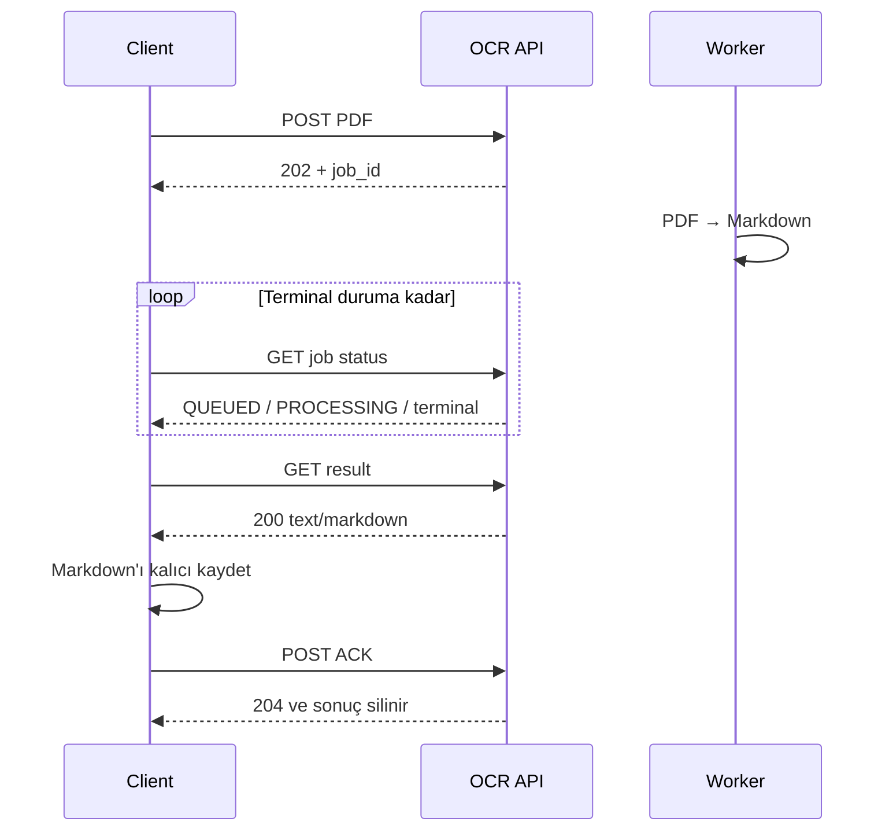

# Django olmOCR Service — Client API Contract

Bu belge, Django olmOCR servisine bağlanacak uygulamalar için kesin entegrasyon sözleşmesidir. Makinece okunabilir eşdeğeri [`openapi.yaml`](openapi.yaml) dosyasındadır.

## 1. Sözleşme özeti

Servis asenkron çalışır. Client PDF'yi gönderir, bir `job_id` alır, durumu poll eder, oluşan Markdown dosyasını indirir ve dosyayı kalıcı olarak kaydettikten sonra ACK gönderir.

Örnek service origin:

```text
https://ocr.example.internal
```

Gerçek ortamda bu değeri deployment adresiyle değiştirin. OCR endpoint'lerinin tabanı:

```text
https://<SERVICE_ORIGIN>/api/v1
```

Path'ler kesindir ve sonunda `/` bulunmaz. Tüm JSON alan adları case-sensitive'dir.

## 2. Authentication

Bütün `/api/v1` isteklerinde aynı inbound service API key gönderilmelidir:

```http
Authorization: Bearer <API_KEY>
```

`job_id` tek başına yetki sağlamaz. Durum sorgulama, Markdown indirme ve ACK dahil bütün OCR çağrıları Bearer API key ister.

Eksik veya geçersiz kimlik bilgisi:

```http
HTTP/1.1 401 Unauthorized
WWW-Authenticate: Bearer
Content-Type: application/json
```

```json
{
  "error": {
    "code": "AUTHENTICATION_FAILED",
    "message": "Valid Bearer credentials are required."
  }
}
```

`GET /health/live` ve `GET /health/ready` kimlik doğrulama istemez.

## 3. Kesin client akışı



Uygulanması gereken sıra:

1. `POST /api/v1/ocr-jobs` ile PDF'yi gönderin.
2. `202` cevabındaki `job_id` değerini kalıcı olarak kaydedin.
3. `GET /api/v1/ocr-jobs/{job_id}` endpoint'ini terminal duruma kadar poll edin.
4. Durum `SUCCEEDED` ise `GET /api/v1/ocr-jobs/{job_id}/result` ile Markdown'ı indirin.
5. HTTP body'nin tamamını okuyup kendi kalıcı depolamanıza başarıyla yazın.
6. Yalnızca kalıcı kayıt doğrulandıktan sonra `POST /api/v1/ocr-jobs/{job_id}/ack` gönderin.

## 4. Job oluşturma

### Request

```http
POST /api/v1/ocr-jobs
Authorization: Bearer <API_KEY>
Content-Type: multipart/form-data; boundary=<client-generated-boundary>
Accept: application/json
```

Multipart form tam olarak bir file part içermelidir:

| Alan | Tür | Zorunlu | Açıklama |
| --- | --- | --- | --- |
| `file` | Binary PDF | Evet | İşlenecek tek PDF dosyası |

JSON, Base64, dosya URL'si veya ek file alanı kabul edilmez. `Content-Type` boundary değerini HTTP client kütüphanesi üretmelidir; elle sabitlemeyin.

Varsayılan deployment sınırları 50 MiB ve 500 sayfadır. Bu sınırlar ortam değişkenleriyle değiştirilebilir; client için kesin limit deployment ekibiyle paylaşılmalıdır.

### Başarılı response

```http
HTTP/1.1 202 Accepted
Content-Type: application/json
```

```json
{
  "job_id": "4d66bc13-725f-49f2-9a67-997d05d3079e",
  "status": "QUEUED",
  "status_url": "https://ocr.example.internal/api/v1/ocr-jobs/4d66bc13-725f-49f2-9a67-997d05d3079e",
  "created_at": "2026-07-13T12:00:00+03:00"
}
```

| Alan | Tür | Açıklama |
| --- | --- | --- |
| `job_id` | UUID string | Sonraki bütün çağrılarda kullanılacak kalıcı iş kimliği |
| `status` | Job status | Yeni iş için `QUEUED` |
| `status_url` | Absolute URI | Polling endpoint'i |
| `created_at` | ISO 8601 date-time | Timezone offset içerebilir |

### Önemli idempotency kuralı

Bu `POST` endpoint'i idempotent değildir ve `Idempotency-Key` desteklemez. Client isteği gönderdikten sonra bağlantı koparsa sunucunun job oluşturup oluşturmadığı belirsiz olabilir. Körlemesine retry yeni ve mükerrer bir job oluşturabilir.

Client mümkünse aldığı `job_id` değerini response döner dönmez kaydetmelidir. Ağ seviyesinde belirsiz create sonucu için otomatik sınırsız retry uygulanmamalıdır.

## 5. Job durumunu sorgulama

### Request

```http
GET /api/v1/ocr-jobs/{job_id}
Authorization: Bearer <API_KEY>
Accept: application/json
```

### `PROCESSING` örneği

```json
{
  "job_id": "4d66bc13-725f-49f2-9a67-997d05d3079e",
  "status": "PROCESSING",
  "created_at": "2026-07-13T12:00:00+03:00",
  "updated_at": "2026-07-13T12:00:05+03:00",
  "started_at": "2026-07-13T12:00:05+03:00",
  "finished_at": null,
  "expires_at": null,
  "error_code": null,
  "result_url": null
}
```

### `SUCCEEDED` örneği

```json
{
  "job_id": "4d66bc13-725f-49f2-9a67-997d05d3079e",
  "status": "SUCCEEDED",
  "created_at": "2026-07-13T12:00:00+03:00",
  "updated_at": "2026-07-13T12:01:30+03:00",
  "started_at": "2026-07-13T12:00:05+03:00",
  "finished_at": "2026-07-13T12:01:30+03:00",
  "expires_at": "2026-07-14T12:01:30+03:00",
  "error_code": null,
  "result_url": "https://ocr.example.internal/api/v1/ocr-jobs/4d66bc13-725f-49f2-9a67-997d05d3079e/result"
}
```

### `FAILED` örneği

```json
{
  "job_id": "4d66bc13-725f-49f2-9a67-997d05d3079e",
  "status": "FAILED",
  "created_at": "2026-07-13T12:00:00+03:00",
  "updated_at": "2026-07-13T12:00:20+03:00",
  "started_at": "2026-07-13T12:00:05+03:00",
  "finished_at": "2026-07-13T12:00:20+03:00",
  "expires_at": null,
  "error_code": "OLMOCR_FAILED",
  "result_url": null
}
```

Response her zaman şu alanları içerir; henüz değeri olmayan alanlar `null` gelir:

| Alan | Tür |
| --- | --- |
| `job_id` | UUID string |
| `status` | Job status |
| `created_at`, `updated_at` | ISO 8601 date-time |
| `started_at`, `finished_at`, `expires_at` | ISO 8601 date-time veya `null` |
| `error_code` | String veya `null` |
| `result_url` | Absolute URI veya `null` |

`result_url` yalnızca durum `SUCCEEDED` iken doludur. Client response alanlarının sırasına güvenmemelidir.

## 6. Job durumları

| Durum | Terminal | Client davranışı |
| --- | --- | --- |
| `QUEUED` | Hayır | Polling'e devam et |
| `PROCESSING` | Hayır | Polling'e devam et |
| `SUCCEEDED` | Sonuç açısından evet | Markdown'ı indir, kaydet ve ACK gönder |
| `FAILED` | Evet | `error_code` kaydet; sonuç isteme |
| `ACKNOWLEDGED` | Evet | Sonuç daha önce alınmış ve silinmiş kabul et |
| `EXPIRED` | Evet | Sonuç retention süresi dolduğu için silinmiş kabul et |

Normal geçişler:

```text
QUEUED → PROCESSING → SUCCEEDED → ACKNOWLEDGED
                    ↘ FAILED
SUCCEEDED → EXPIRED
```

## 7. Markdown sonucunu indirme

### Request

```http
GET /api/v1/ocr-jobs/{job_id}/result
Authorization: Bearer <API_KEY>
Accept: text/markdown
```

### Başarılı response

```http
HTTP/1.1 200 OK
Content-Type: text/markdown; charset=utf-8
Content-Disposition: attachment; filename="document.md"
Cache-Control: no-store
```

Response body doğrudan Markdown'dır; JSON değildir:

```markdown
# Document title

OCR output...
```

Client, `200` response'u stream ederek dosyaya yazmalıdır. Büyük sonuçlar için body'yi tek seferde belleğe alma zorunluluğu yoktur. Non-2xx cevaplarda content type `application/json` ise standart hata zarfını parse edin.

İndirme işlemi sonucu silmez. ACK gelene veya retention süresi dolana kadar indirme tekrarlanabilir.

## 8. Sonucu ACK etme

### Request

```http
POST /api/v1/ocr-jobs/{job_id}/ack
Authorization: Bearer <API_KEY>
Content-Length: 0
```

Request body gönderilmez.

### Başarılı response

```http
HTTP/1.1 204 No Content
```

`204` response body içermez. İlk başarılı ACK Markdown nesnesini siler ve job durumunu `ACKNOWLEDGED` yapar. Aynı job için ACK tekrar edilirse yine `204` döner; dolayısıyla başarılı ACK sonrası retry idempotent'tir.

Silme geçici olarak başarısız olursa `503 OBJECT_STORE_UNAVAILABLE` döner, job `SUCCEEDED` kalır ve ACK güvenle tekrar denenebilir. `EXPIRED` job için ACK `410 RESULT_GONE` döner.

## 9. Hata formatı

Uygulama tarafından yönetilen JSON hataları şu zarfı kullanır:

```json
{
  "error": {
    "code": "JOB_NOT_READY",
    "message": "The OCR result is not ready."
  }
}
```

Client kontrol akışını `message` yerine kararlı `error.code` alanına göre kurmalıdır. Proxy, ingress veya beklenmeyen sunucu hatalarında JSON dışı bir body gelebileceği için önce HTTP status ve `Content-Type` kontrol edilmelidir.

### HTTP status tablosu

| HTTP | Anlam | Retry yaklaşımı |
| --- | --- | --- |
| `200` | GET başarılı | Gerekmez |
| `202` | Job kabul edildi | `job_id` kaydet ve poll et |
| `204` | ACK başarılı | İşlem tamamlandı |
| `400` | Geçersiz request/PDF | Aynı request'i retry etme |
| `401` | API key eksik/geçersiz | Credential düzeltmeden retry etme |
| `404` | Job yok veya UUID/path yanlış | Terminal client hatası kabul et |
| `409` | Sonuç hazır değil, job failed veya ACK uygun değil | Job durumunu yeniden sorgula |
| `410` | Sonuç silinmiş/expired | Terminal kabul et |
| `413` | Upload limiti aşıldı | Dosya/limit değişmeden retry etme |
| `503` | Geçici bağımlılık sorunu | Exponential backoff + jitter ile sınırlı retry |

### Upload ve request hata kodları

| Kod | Tipik HTTP | Açıklama |
| --- | --- | --- |
| `AUTHENTICATION_FAILED` | 401 | Bearer API key geçersiz |
| `INVALID_FILE_FIELDS` | 400 | Tam olarak bir `file` alanı gönderilmedi |
| `INVALID_REQUEST` | 400 | Request serializer doğrulaması başarısız |
| `UPLOAD_TOO_LARGE` | 413 | Byte limiti aşıldı |
| `INVALID_PDF_SIGNATURE` | 400 | Dosya byte sıfırda `%PDF-` ile başlamıyor |
| `INVALID_PDF` | 400 | PDF okunabilir değil |
| `PDF_PAGE_COUNT_UNAVAILABLE` | 400 | Sayfa sayısı belirlenemedi |
| `EMPTY_PDF` | 400 | PDF'de sayfa yok |
| `PDF_PAGE_LIMIT_EXCEEDED` | 400 | Sayfa sınırı aşıldı |
| `PDFINFO_UNAVAILABLE` | 503 | PDF doğrulama bağımlılığı yok |
| `PDFINFO_TIMEOUT` | 503 | PDF doğrulama zaman aşımı |
| `OBJECT_STORE_UNAVAILABLE` | 503 | Geçici nesne depolama erişilemiyor |
| `OBJECT_STORE_NOT_CONFIGURED` | 503 | Nesne depolama yapılandırması eksik |
| `QUEUE_UNAVAILABLE` | 503 | Celery/Redis kuyruğu erişilemiyor |

### Processing sırasında `error_code` olabilecek başlıca değerler

| Kod | Açıklama |
| --- | --- |
| `INPUT_INTEGRITY_FAILED` | Worker'ın indirdiği PDF digest'i upload digest'iyle eşleşmedi |
| `OLMOCR_UNAVAILABLE` | Worker image'ında olmOCR çalıştırılamadı |
| `OLMOCR_NOT_CONFIGURED` | olmOCR server/model ayarı eksik |
| `OLMOCR_INVALID_CONFIGURATION` | Sayısal olmOCR ayarı geçersiz |
| `OLMOCR_TIMEOUT` | OCR process timeout'a ulaştı |
| `OLMOCR_FAILED` | olmOCR sınırlı retry sonrasında tamamlanamadı |
| `OLMOCR_RESULT_MISSING` | Markdown çıktısı oluşmadı |
| `OLMOCR_RESULT_TOO_LARGE` | Markdown sonuç limiti aşıldı |
| `OLMOCR_RESULT_INVALID` | Markdown birleştirme/encoding hatası |
| `OBJECT_STORE_UNAVAILABLE` | Worker input/result nesnesine erişemedi |
| `OBJECT_STORE_NOT_CONFIGURED` | Worker object store yapılandırması eksik |
| `INTERNAL_PROCESSING_ERROR` | Beklenmeyen ve ayrıntısı dışarı açılmayan worker hatası |

## 10. Polling, timeout ve retry kuralları

- Önerilen ilk polling aralığı 2–5 saniyedir.
- Servis `Retry-After` header'ı göndermez; client kendi backoff politikasını uygular.
- Uzun süren işler için aralık kademeli olarak artırılabilir; örneğin 2, 3, 5, 8 saniye ve üst sınır 10 saniye.
- Polling yalnız `QUEUED` ve `PROCESSING` durumlarında devam etmelidir.
- Status ve result GET çağrıları tekrar edilebilir.
- ACK, başarılı ilk ACK'den sonra idempotent'tir; ağ hatası veya `503` sonrası tekrar denenebilir.
- Create POST idempotent değildir. Ağ sonucu belirsizse otomatik retry mükerrer job oluşturabilir.
- `503` retry'larında exponential backoff ve jitter kullanın; sonsuz retry uygulamayın.
- HTTP connect/read timeout değerlerini client ortamına göre açıkça yapılandırın. OCR işinin tamamlanmasını tek HTTP bağlantısı açık tutarak beklemeyin.

## 11. cURL örnekleri

```bash
SERVICE_ORIGIN="https://ocr.example.internal"
API_KEY="replace-with-runtime-secret"

curl --fail-with-body \
  -X POST "$SERVICE_ORIGIN/api/v1/ocr-jobs" \
  -H "Authorization: Bearer $API_KEY" \
  -H "Accept: application/json" \
  -F "file=@document.pdf"
```

```bash
curl --fail-with-body \
  "$SERVICE_ORIGIN/api/v1/ocr-jobs/$JOB_ID" \
  -H "Authorization: Bearer $API_KEY" \
  -H "Accept: application/json"
```

```bash
curl --fail-with-body \
  "$SERVICE_ORIGIN/api/v1/ocr-jobs/$JOB_ID/result" \
  -H "Authorization: Bearer $API_KEY" \
  -H "Accept: text/markdown" \
  --output result.md
```

```bash
curl --fail-with-body \
  -X POST "$SERVICE_ORIGIN/api/v1/ocr-jobs/$JOB_ID/ack" \
  -H "Authorization: Bearer $API_KEY"
```

## 12. Client pseudocode

```text
createResponse = POST multipart /api/v1/ocr-jobs(file=pdf)
require createResponse.status == 202
jobId = createResponse.json.job_id
persist(jobId)

loop:
    statusResponse = GET /api/v1/ocr-jobs/{jobId}
    require statusResponse.status == 200
    job = statusResponse.json

    if job.status in [QUEUED, PROCESSING]:
        wait(nextPollingDelayWithJitter())
        continue

    if job.status == FAILED:
        recordFailure(job.error_code)
        stop

    if job.status in [ACKNOWLEDGED, EXPIRED]:
        recordResultUnavailable(job.status)
        stop

    require job.status == SUCCEEDED
    break

resultResponse = GET /api/v1/ocr-jobs/{jobId}/result
require resultResponse.status == 200
require contentTypeStartsWith(resultResponse, "text/markdown")
streamBodyToDurableFile(resultResponse.body)
fsyncOrConfirmRemoteCommit()

ackResponse = POST /api/v1/ocr-jobs/{jobId}/ack with empty body
require ackResponse.status == 204
markCompleted(jobId)
```

## 13. Health endpoint'leri

### Liveness

```http
GET /health/live
```

`200`:

```json
{"status":"ok"}
```

### Readiness

```http
GET /health/ready
```

PostgreSQL ve Redis hazırsa `200`:

```json
{"status":"ready"}
```

Bağımlılıklardan biri hazır değilse `503`:

```json
{"status":"not_ready"}
```

Health endpoint'leri client iş akışı için değil deployment probe'ları içindir.

## 14. Sözleşmede bulunmayan davranışlar

Mevcut API şu özellikleri sağlamaz:

- Webhook/callback
- Batch upload
- Job listeleme veya pagination
- Job iptali
- Idempotency key
- Presigned result URL
- API key oluşturma/yenileme endpoint'i
- JSON içinde Markdown sonucu

Client bu davranışları varsaymamalıdır.
