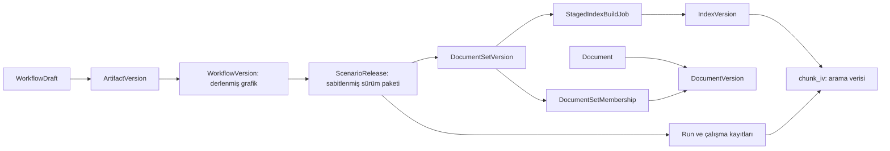

# Veritabanı mimarisi ve sadeleştirme değerlendirmesi

Tarih: 2026-09-08. Kapsam: mevcut çalışma ağacı ve yerel geliştirme PostgreSQL’i. Bu bir inceleme çıktısıdır; önerilen dönüşümler uygulanmadı ve uygulama taahhüdü değildir. [Envanter](inventory.md), [doğrulama](verification.md), [riskler](threat-model.md).

## Sonuç

**Sadeleştirme mümkün.** En belirgin fırsat eski/yeni indeksleme yollarının birlikteliği ve bağlayıcı başına tekrarlanan senkronizasyon modelleri. Buna karşılık sürüm, yetki, çalışma durumu ve denetim kayıtlarının çoğu farklı yaşam döngülerini temsil ediyor. Tablo sayısını tek başına başarı ölçütü yapmak bu ayrımları uygulama koduna veya büyük JSON alanlarına taşıyabilir.

İlk kapsam için **80 uygulama tablosundan 74’e inebilecek üç aday** var: eski indeksleme yolu −3, senkronizasyon kayıtları −2, taslaklar −1. Bu rakam, eski yolun tüm kullanımının yeni yola taşınabildiği ve birleşimlerin ek kalıcı tablo gerektirmediği varsayımına bağlı bir tasarım hesabıdır; kanıtlanmış migration sonucu değildir. Daha büyük düşüş, kapsam azaltma veya daha pahalı mimari dönüşüm gerektirir.

## Gerçekte kaç tablo var?

| Grup | Sabit tablo sayısı |
|---|---:|
| Veri alma, bağlayıcılar ve indeks hazırlama (`ingestion`) | 25 |
| Dokümanlar, sürümler ve erişim (`documents`) | 10 |
| İş akışı ve kalıcı çalışma durumu (`workflows`) | 9 |
| Kimlik, sorumluluk ve tüketici erişimi (`identity`) | 8 |
| Değerlendirme (`evaluations`) | 7 |
| Araç kataloğu, çağrılar ve onay (`tools`) | 6 |
| Diğer uygulama alanları | 15 |
| **Uygulama toplamı** | **80** |
| Django kullanıcı/izin/oturum/admin/content-type tabloları ve migration kaydı | 10 |
| **Sabit toplam** | **90** |

Yerelde bunlara **9 dinamik `chunk_iv_*` tablosu** ekleniyor: toplam **99**. Django metaverisindeki 89 model/otomatik ara tablosu ile migration son durumu eşleşiyor; `django_migrations` eklenince fiziksel 90 sabit tabloyla da tam eşleşiyor. Bekleyen migration yok. Dolayısıyla yerel şemada eski migration’lardan kalmış, mevcut model karşılığı olmayan fazladan sabit tablo tespit edilmedi.

İnceleme anında sabit tablolar indeks ve TOAST dahil yaklaşık 9.1 MiB, dinamik vektör tabloları yaklaşık 8.9 MiB tutuyordu. Bu küçük geliştirme verisi performans sorunu veya üretim kapasitesi kanıtı değildir. İstatistiksel `n_live_tup` değerleri gerçek sayımlarla uyuşmadığından boşluk kararlarında kullanılmadı; yalnızca `COUNT(*)` sonuçları esas alındı.

## Ana veri akışı

Şema kavramsal akışı gösterir; her ok doğrudan veritabanı yabancı anahtarı değildir. Dosyanın kendisi nesne deposunda, sürüm/üyelik metaverisi PostgreSQL’de, iş teslimi Redis/Celery üzerinden, kalıcı iş durumu tekrar PostgreSQL’dedir. Bu yüzden her “iş” veya “doküman” isimli tablo aynı varlığı tutmaz.

## Öncelikli sadeleştirme adayları

### 1. Eski indeksleme yolunu tek doküman akışına taşıma — yüksek değer, orta/yüksek geçiş riski

[`IngestionRun`, `IndexedDocument`, `Chunk`](../../../../apps/ingestion/models.py) eski kaynak tabanlı yolun üç tablosu. Yeni akış `DocumentVersion → StagedIndexBuildJob → IndexVersion → chunk_iv_*` üzerinden çalışıyor. Yerelde bu üç eski tabloda **0 kayıt** var; tek `Source` türü `generic_rest`.

Ancak eski yol silinebilir ölü kod değil: [`ingestion/services.py`](../../../../apps/ingestion/services.py) bu tablolara yazıyor; [`retrieval/providers.py`](../../../../apps/retrieval/providers.py) eski `Chunk` tablosundan okuyan geri uyumluluk dalını koruyor. MCP ingestion durumu, yeniden deneme komutu, operasyon ekranı ve gözlemlenebilirlik sinyalleri `IngestionRun` kullanıyor.

Öneri: eski kaynakları yönetilen doküman sürümlerine alan tek adaptör akışına geçirmek; durum/yeniden deneme/MCP yüzeylerini yeni kalıcı iş modeline taşımak. `Source` ve `IndexVersion` yeni yolda da kullanıldığı için kaldırılmamalı. Dağıtım genelinde eski okuyucu/yazıcı ve bekleyen işler kapandıktan, korunacak veri dönüştürüldükten ve açık onay alındıktan sonra üç eski tablo kaldırılabilir. **Kazanç yalnızca −3 tablo değil, iki veri işleme yolunun bakımının bitmesi.**

### 2. REST ve Confluence senkronizasyon modellerini ortaklaştırma — orta değer, orta risk

[`RestSyncRun` / `ConfluenceSyncRun`](../../../../apps/ingestion/models.py) aynı durum, deneme, hata, snapshot, değişen/eksik doküman sayacı, takvim dilimi ve aday sürüm alanlarının büyük bölümünü tekrarlıyor. [`scheduler.py`](../../../../apps/ingestion/scheduler.py) aynı işi iki tablo için ayrı dallarla yapıyor. Cursor çiftinde de kaynak, doküman sürümü, son görülme ve eksik kayıt takibi ortak.

Öneri: `ConnectorSyncRun` ve `ConnectorDocumentCursor` adlı iki ortak model; mevcut dört tablo yerine iki tablo. Profil/REST sözleşmesi yabancı anahtarları korunmalı; bağlayıcı türüne göre geçerli alan birleşimleri veritabanı kontrolleriyle sınırlandırılmalı. Confluence’ın kök sayfa, sayısal sürüm ve zaman bilgisi REST’in opak revision alanına kayıpsız eşlenmeli. Bunları belirsiz bir JSON içine atmak önerilmiyor.

Bağlayıcıların ağ güvenliği, kimlik doğrulaması ve retry kuralları aynı değildir; ortak kayıt modeli ortak ağ politikası anlamına gelmez. Takvim dilimi tekilliği, kilitleme, idempotency ve eksik doküman davranışı korunmalı. Yerelde REST run/cursor tablolarında 1/2 kayıt bulunuyor; Confluence boşluğu özelliğin kaldırılması için kanıt değil. Aday tasarımda **−2 tablo**.

### 3. İki taslak tablosunu birleştirme — düşük/orta değer, orta risk

[`WorkflowDraft` ve `ArtifactDraft`](../../../../apps/builder/models.py) aynı organizasyon/proje/senaryo, ad, gövde, düzenleme revision’ı, son yayınlanan sürüm ve aktör alanlarını taşıyor. Workflow’a özel editör durumu ayrı bir fiziksel tabloyu zorunlu kılmıyor; ortak `ArtifactDraft` içinde tür ile temsil edilebilir.

Workflow ve diğer taslakların doğrulayıcıları ayrı kalmalı. `(organization, artifact_type, logical_id)` tekilliği, eşzamanlı düzenleme revision kontrolü, mevcut taslak kimlikleri ve API cevapları korunmalı; iki tabloda çakışan sayısal kimlikler için geçiş eşlemesi gerekir. Yayınlanan `ArtifactVersion` ile taslak birleştirilmemeli. Yerelde 28 workflow ve 13 artifact taslağı var. Aday tasarımda **−1 tablo**; tek başına migration maliyetini haklı çıkarmayabilir, editör bakımıyla birlikte ele alınmalı.

## Dinamik vektör tabloları: sayısı büyüyen asıl bölüm

Her hazırlanmış indeks sürümü kendi fiziksel tablosunu oluşturuyor. Bu, [ADR-0003](../../../adr/0003-vector-storage-blue-green-per-index-version.md) ile verilmiş açık bir karar: yeni indeks hazırlanırken eskisi hizmet verebiliyor, etkinleştirme/geri alma metaveri işaretçisi üzerinden yapılıyor, farklı embedding boyutları birlikte yaşayabiliyor.

Yerelde 9 fiziksel store: **5 active, 1 promotable, 3 superseded**. Ek olarak fiziksel store’u olmayan 9 failed indeks kaydı var. Metadata’sı bulunmayan sahipsiz store sayısı **0**. Kullanılan boyut/türler `vector(64)`, `vector(1536)`, `halfvec(3072)`; tek sabit boyutlu tabloya doğrudan geçiş mevcut çeşitliliği karşılamaz.

`retire_staged_index` ve kontrollü store silme işlevi mevcut. Ancak kaynak taramasında `retire_staged_index` için tanımı dışında çağıran bulunmadı. Var olan genel retention işi yalnızca çalışma payload’larını temizliyor; vektör store’larını kapsamıyor. Bu, **envanter ve saklama yaşam döngüsünü tamamlama ihtiyacı**; üç superseded store’un bugün güvenle silinebileceği anlamına gelmez. Geri dönüş penceresi, release/run/evaluation referansları ve kaynak veriden yeniden oluşturulabilirlik önce belirlenmeli.

Önce yalnızca raporlayan store envanteri, sonra onaylanmış saklama politikası öneriyorum. Fiziksel birleştirme ancak store sayısı ve operasyon maliyeti ölçülünce düşünülmeli. Boyut/model grubu başına ortak tablo ve uygun filtreli indeksler teknik alternatif olabilir; HNSW indeksleri aynı boyuttaki vektörlerle sınırlandırılmalı. [Kurulu sürümle eşleşen pgvector 0.8.4 belgesi](https://github.com/pgvector/pgvector/blob/v0.8.4/README.md#can-i-store-vectors-with-different-dimensions-in-the-same-column) bunu destekliyor. Aynı boyut farklı model embedding’lerinin karşılaştırılabilir olduğu anlamına gelmez; model/sürüm/tenant kapsamı korunmalı. Ortak store önerisi proje için bir çıkarımdır; RLS, recall, sorgu planı, eşzamanlı hazırlama ve rollback ölçülmeden tercih edilmemeli. Her indeks sürümüne partition açmak da fiziksel tablo sayısını ortadan kaldırmaz.

## Korumayı önerdiğim ayrımlar

| Ayrım | Neden korunmalı? |
|---|---|
| `Document` / `DocumentVersion` / set sürümü / üyelik | Aynı belge sürümünün birden fazla sabitlenmiş sette kullanımı ve eski release’lerin değişmemesi. Üyelikte `PROTECT` ve tekillik mevcut. |
| `DocumentVersionSummary` | Tek dokümana tek alan değil: model ve prompt’a göre birden fazla türetilmiş özet/provenance destekliyor. |
| Taslak / artifact / derlenmiş workflow / release | Düzenlenebilir kaynak, değişmez tanım, compiler sürümlü çıktı ve yayına alınan paket farklı yaşam döngüleri. |
| Binding / erişim talebi / senaryo grant / consumer grant | Konfigürasyon, onay geçmişi ve iki ayrı canlı yetki. Retrieval kodu consumer ve senaryo grant’lerini birlikte denetliyor. |
| Organizasyon/proje/senaryo/doküman sorumlulukları | Açık yabancı anahtarlar, farklı kapsam ve tekillikler. Tek `scope_type/scope_id` tablosu ilişkisel bütünlük ve tenant denetimini zorlaştırabilir. Ortak abstract model zaten kod tekrarını azaltıyor. |
| `ModelProfile` / model-profile artifact | İlki platformun endpoint/secret referansını, ikincisi yalnızca izin verilen `profile_id` referansını taşıyor. Birleştirme güven sınırını değiştirebilir. |
| `Run`, `RunWait`, branch/join, child, compensation, event | Bekleme/yeniden başlatma, paralel yürütme, telafi ve olay geçmişinin farklı kardinalite/kilit/tekillik kuralları var. Örneğin aynı run için tek pending wait DB kısıtı. |
| Build job / outbox | İşin yapılması ve kuyruğa güvenilir teslimi farklı durumlar. Mevcut outbox iş ile aynı transaction’da yazılıyor; ayrı dispatch kilitleri var. Tek tabloyla yapılması teorik olarak mümkün, ancak mevcut güvenilirliği yeniden tasarlamanın getirisi düşük. |
| Audit / usage / run event | Denetim kanıtı, tüketim ölçümü ve çalışma geçmişinin saklama/erişim amaçları farklı. |

Artifact türleri zaten tek `ArtifactVersion` tablosunda toplanmış. Agent ve workflow çalışma tablolarının birleştirilmesi de [ADR-0014](../../../adr/0014-unified-workflow-engine-cutover.md) ile yapılmış; bugün ayrı bir `AgentRun` tablosu yok. Tarihsel migration dosyalarındaki model isimlerini güncel tablo sayısına katmamak gerekiyor.

## İkinci aşamada değerlendirilebilecek tekrar

`EvalRun/EvalCaseResult` ile `QuestionEvaluationRun/QuestionEvaluationEvidence` ortak yürütme/sonuç çatısına aday. Fakat ilki [`releases/lifecycle.py`](../../../../apps/releases/lifecycle.py) içindeki deterministik yayın kapısı; ikincisi serbest metin cevap, retrieval kanıtı, isteğe bağlı LLM judge, iptal ve retention taşıyor. “Başarılı değerlendirme” anlamları eşdeğer değil. Önce ortak servis/protokol ve açık amaç alanı; tablo birleşimi ancak yayın kapısının checksum ve güvenilir kanıt koşulları korunabiliyorsa düşünülmeli. Bu aday ilk −6 hesabına dahil değil.

## Önerilen sıra ve kabul kapıları

1. Tablo envanterini ürün alanlarına göre görünür kıl; vektör store envanterini raporla. Tablo silmeden anlaşılabilirlik ve işletim kazanımı.
2. Eski ingestion yolunun deployment genelindeki kullanımını doğrula. Yeni akışa dönüşüm, sonuç karşılaştırması, eski writer/worker kesilmesi ve geri dönüş kanıtı sonrası emekliye ayır.
3. Bağlayıcı senkronizasyon kaydını ortaklaştır. Snapshot/cursor lineage, retry, tek takvim dilimi ve tenant denetimi eşdeğerliğini test et.
4. Taslak birleştirmesini editör/API bakım çalışmasıyla birlikte yap.
5. Vektör fiziksel topolojisini ve değerlendirme tablolarını ancak ölçülen ihtiyaçla yeniden ele al.

Her uygulama adımı için ayrı onaylı plan; eklemeli şema, veri eşleme/backfill, karşılaştırmalı doğrulama, kontrollü okuyucu/yazıcı geçişi ve rollback gerekir. Eski tabloların kaldırılması son ve açıkça onaylanacak adımdır. Bu inceleme silme veya yetki değişikliği izni oluşturmaz.

## Rapor kapanışı

- **Summary:** Sadeleştirme fırsatları ve korunacak sınırlar kaynak/runtime kanıtıyla belirlendi.
- **Files changed:** İnceleme planı, risk, değerlendirme, envanter, doğrulama; master-plan ve arşiv bağlantıları.
- **Architecture impact:** Yalnızca öneri; mevcut mimari değişmedi.
- **Security impact / Authorization impact:** Hiçbir kontrol değişmedi. Gelecekteki dönüşümlerde RLS, kapsam ve onay sınırları korunmalı.
- **Data and privacy impact:** Yalnızca yerel tablo/kayıt adetleri ve şema okundu; içerik ve kimlik bilgisi sorgulanmadı.
- **Logging, metrics, tracing and audit impact:** Değişiklik yok.
- **Database and migration impact:** Değişiklik yok; canlı sorgular read-only.
- **Tests and verification results:** 60 passed, 2 PostgreSQL RLS testi skipped; model/migration/fiziksel tablo adları uyumlu; migration drift yok. Ayrıntı doğrulama kaydında.
- **Unverified assumptions:** Diğer dağıtımlarda eski akış kullanımı, üretim yükü ve saklama gereksinimleri bilinmiyor.
- **Remaining risks:** −6 aday tasarım hesabı; veri dönüşümü ve çalışma eşdeğerliği uygulanıp doğrulanmadı. Üretim performansı ölçülmedi.
- **Manual review required:** İncelemeyi kullanmak için ek işlem gerekmiyor; uygulama öncesi eski özellik kapsamı, saklama penceresi ve geçiş planı ürün sahibi tarafından kararlaştırılmalı.
